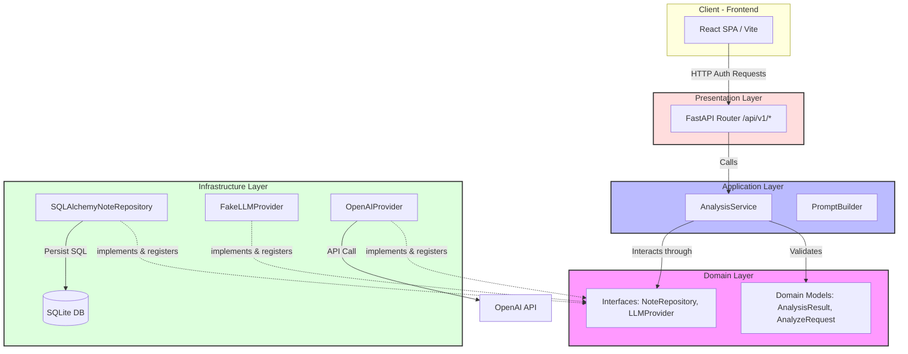
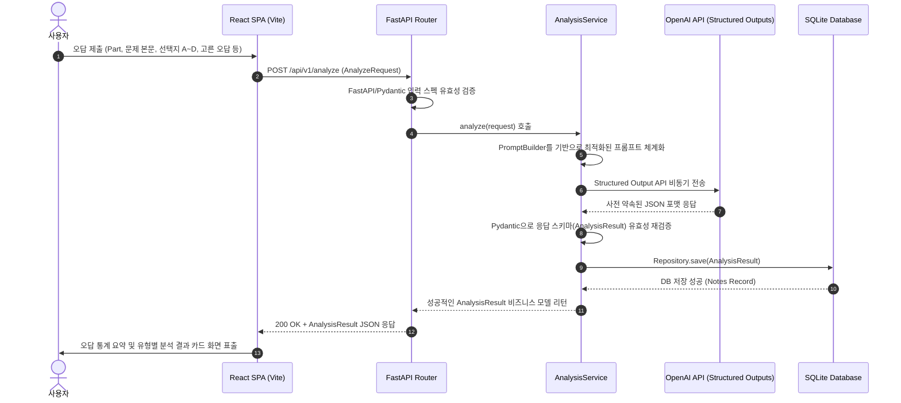

# 📝 TOEIC Wrong Note AI (토익 오답 분석 AI 플랫폼)

<div align="center">
  
</div>

[](https://www.python.org/)
[](https://fastapi.tiangolo.com/)
[](https://reactjs.org/)
[](https://www.typescriptlang.org/)
[]()
[](https://opensource.org/licenses/MIT)

> **"무작정 많이 푸는 오답 노트는 끝났습니다. AI 기반의 정밀 분석으로 당신의 진짜 약점을 교정하세요."**  
> **TOEIC Wrong Note AI**는 사용자가 입력한 토익 오답 데이터(문제, 선택지, 선택한 오답 등)를 분석하여 문법·어휘·독해 등 **12가지 정밀 오답 분류 체계**에 맞춰 분석 카드를 생성하고 학습 가이드를 제시하는 풀스택 포트폴리오 웹 애플리케이션입니다.

---

## 🚀 프로젝트 핵심 우수성 (Portfolio Key Points)

본 프로젝트는 단순한 API 호출 프로젝트를 넘어, **실무 수준의 소프트웨어 구조와 엔지니어링 규칙**에 맞춰 정밀하게 설계되었습니다. 채용 및 기술 면접에서 강점이 될 핵심 설계 특징들을 어필합니다.

### 1. SOLID 원칙과 Clean Layered Architecture 구축
* **의존성 역전 원칙 (DIP) 적용**: 고수준 비즈니스 로직(Application Layer)이 데이터베이스(`SQLAlchemy`)나 외부 서비스(`OpenAI SDK`) 등 인프라 세부 사항에 직접 의존하지 않고, 추상화된 추상 클래스(Interface Protocol)에만 의존하도록 설계했습니다.
* **낮은 결합도와 높은 응집도**: Presentation(FastAPI Router) - Application(Services) - Domain(Interfaces, Models) - Infrastructure(DB, OpenAI Client) 레이어를 물리적으로 격리하여, 향후 DB를 SQLite에서 PostgreSQL이나 타 RDBMS로 전환하거나, LLM 모델을 변환하더라도 핵심 도메인 코드가 전혀 수정되지 않는 높은 유연성을 확보했습니다.

### 2. 엄격한 TDD (Test-Driven Development) 프로세스 준수
* **테스트 커버리지 중심 개발**: 도메인 모델 검증, API 요청 바인딩 스키마, 프롬프트 빌더, 비즈니스 조율 로직(AnalysisService) 등의 백엔드 핵심 계층 구현 과정에서 **선(先) 테스트 작성 - 후(後) 기능 보완**의 TDD 사이클을 엄격하게 돌려 안정성을 입증했습니다.
* **CI/CD 파이프라인 자동화**: GitHub Actions를 이용하여 Pull Request 또는 Push 발생 시 자동으로 백엔드 테스트 코드(`pytest`) 및 린터 검증 파이프라인을 운영하여 코드 퀄리티를 유지합니다.

### 3. OpenAI Structured Outputs & Pydantic을 활용한 타입 안정성 (Type Safety)
* LLM 생성 데이터의 불확실성을 극복하기 위해 `OpenAI Structured Outputs API`를 결합하여, AI가 항상 사전에 구조화된 JSON 스키마를 100% 준수하도록 유도했습니다.
* 반환된 데이터는 API 네트워크 경계에서 **Pydantic 스키마 검증**을 통해 실시간으로 타입 안정성(Type-matching)이 확인되므로, 프론트엔드가 안심하고 오답 유형, 번역 정보, 어휘 목록 등을 깨짐 없이 렌더링하도록 보장합니다.

### 4. 비용 최적화 및 로컬 격리 개발을 위한 `FakeLLMProvider` 설계
* 로컬 개발 단계 및 CI 테스트 러너 환경에서 매번 상용 API 토큰이 고갈되거나 네트워크 지연이 생기는 것을 해결하기 위해 **가짜 LLM 프로바이더(Fake LLM Provider)**를 구축했습니다.
* 환경 변수(`LLM_PROVIDER=fake`) 조정을 통해 실제 AI를 통하지 않고도 규칙적이고 상세한 Mock 분석 스키마를 실시간 렌더링하고 유닛 테스트를 완벽하게 통과시켜 개발 및 상용 운영 비용을 획기적으로 낮췄습니다.

---

## 📐 시스템 아키텍처 (System Architecture)

### 1. 의존성 관점의 계층 구조 (Layered Architecture & DIP)

본 프로젝트의 패키지 및 의존성은 안쪽(Domain) 방향으로만 주입됩니다. 외부의 통신, DB 계층은 인터페이스를 충족함으로써 코어 엔진에 스펙을 공급합니다.



### 2. 요청-응답 수명 주기 (Request-Response Life Cycle)

사용자의 오답 제출 시 어떻게 구조화된 복습 가이드와 추천 어휘가 데이터베이스에 축적되는지를 단계별로 묘사합니다.



---

## ✨ 핵심 기능 (Features)

* **12가지 오답 유형 정밀 분류**: 문법(품사, 시제, 수일치, 접속사), 어휘(혼동 어휘, 전치사), 독해(EVIDENCE, 패러프레이징) 등으로 오답의 메인/보조 원인을 AI로 진단 및 태깅합니다.
* **AI 정정 해설 카드**:
  * 문제 본문 및 보기에 대한 매끄러운 한글 **번역**
  * 정답과 오답이 각각 될 수밖에 없었던 문법적/구조적 **핵심 해설 제공**
  * 향후 복습을 위한 **학습 포인트** 및 **유사 영작 예문 3개와 팁** 제공
  * 문제에서 추출한 **실전 어휘 리스트 (단어, 품사, 예문)** 자동 빌더
* **오답 데이터 보관 및 CRUD**: SQLite 관계형 스키마와의 맵핑 및 페이징 처리를 지원하는 오답 보관함.
* **약점 분석 대시보드 (Dashboard)**: 사용자의 오답 히스토리로부터 Part별 에러 빈도, 오답 유형 비율(품사 오류가 과다한지 여부 등)을 차트로 분석하여 메인 화면에 렌더링.

---

## 📂 프로젝트 폴더 구조 (Project Directories)

```
TOEIC-Wrong-Note-AI/
├── docs/                          # 프로젝트 설계 관련 명세서
│   ├── ANALYSIS_GUIDE.md          # 12가지 오답 유형 분류 및 스키마 명세
│   └── TECH_SPEC.md               # 전반적인 기술 인프라 및 설계 사양서
│
├── frontend/                      # 프론트엔드 (React + TypeScript + Vite)
│   ├── src/
│   │   ├── api/                   # API 통신 바인딩 모듈
│   │   ├── components/            # 차트, 폼, 결과 카드 공통 컴포넌트
│   │   ├── pages/                 # 입력창, 대시보드, 리스트 개별 뷰
│   │   └── types/                 # 스키마 매핑용 TypeScript 인터페이스
│
├── src/                           # 백엔드 코어 (FastAPI + Pydantic + Clean Architecture)
│   ├── config/                    # 환경변수 로딩 및 의존성 주입(DIP Factory)
│   ├── domain/                    # 핵심 비즈니스 모델, 인터페이스(Protocol)
│   ├── application/               # 유스케이스 서비스, 프롬프트 가공기
│   ├── infrastructure/            # 데이터베이스 접근(SQLite ORM), OpenAI API 프로바이더
│   └── presentation/              # RESTful API 라우터 구현체
│
├── tests/                         # TDD 검증을 위한 테스트 디렉토리
│   ├── unit/                      # 모델, 단위 서비스, 프롬프트 단위 테스트
│   └── integration/               # 통합 API 흐름 및 DB 연계 검사
│
├── requirements.txt               # 백엔드 바이너리 의존성
├── create_issues.py               # 개발 로드맵 관리용 GitHub Issues 동기화 도구
└── pyproject.toml                 # Pytest 런타임 제어 설정
```

---

## 🛠️ 기술 스택 (Tech Stack)

### Frontend
- **React (v18+)** with **TypeScript** & **Vite**
- **Vanilla CSS** & **CSS Modules** (브라우저 최적화 및 캡슐화)
- **Chart.js** / **Recharts** (대시보드 통계 시각화)

### Backend
- **Python (v3.11+)**
- **FastAPI** (비동기 네이티브 웹 프레임워크)
- **Pydantic (v2)** (스키마 설계 및 강력한 런타임 유형 단언)
- **SQLAlchemy** & **SQLite / PostgreSQL** (RDBMS 및 ORM)
- **OpenAI API (gpt-4o-mini)** (구조화된 출력 지시 모드를 활용한 AI 분석가)

### DevOps
- **GitHub Actions** (CI/CD, pytest 유닛 테스트 자동 구동)
- **GitHub Pages** (프론트엔드 정적 호스팅)

---

## ⚙️ 로컬 개발 환경 실행 방법 (Installation & Run)

### Prerequisites
* Python 3.11 이상 설치
* Node.js v20 이상 설치
* GitHub CLI (`gh`) 또는 OpenAI API Key (선택 사항)

### 1. 백엔드 설정 (Backend Server Setup)
```bash
# 가상 환경 생성 및 진입
python -m venv .venv
Source .venv/Scripts/activate # Windows 

# 의존성 패키지 설치
pip install -r requirements.txt

# 설정 환경파일 구성 (.env 설정)
cp .env.example .env

# 테스트 코드 전체 실행 (TDD 검증)
pytest
```

#### `.env` 환경 변수 관리 가이드
```ini
APP_ENV=development
LLM_PROVIDER=fake                  # API 크레딧 아끼기 위해 개발 모드에서는 fake 사용
# LLM_PROVIDER=openai              # 실제 AI를 호출해 보려면 openai 기입
OPENAI_API_KEY=your-api-key-here   # openai 모드 사용 시 필수
DATABASE_URL=sqlite:///./notes.db  # SQLite 경로
```

#### 백엔드 서버 기동 (FastAPI 실행)
```bash
python app.py
# 또는 uvicorn src.presentation.api:app --reload
```
* 백엔드가 구동되면 `http://localhost:8000/docs`에서 Swagger API 문서를 바로 탐색할 수 있습니다.

### 2. 프론트엔드 설정 (Frontend Setup)
```bash
cd frontend

# 패키지 의존성 다운로드
npm install

# Local Dev Server 구동 (Vite)
npm run dev
```
* 브라우저에서 `http://localhost:5173` 링크를 통해 오답 신청 및 차트 모니터링 화면으로 접속할 수 있습니다.

---

## 🎓 라이선스 (License)

본 프로젝트는 [MIT License](./LICENSE) 하에 자유로운 수정 및 2차 가공이 허용됩니다. 대학생의 이직, 채용 포트폴리오 활용을 추천합니다.
